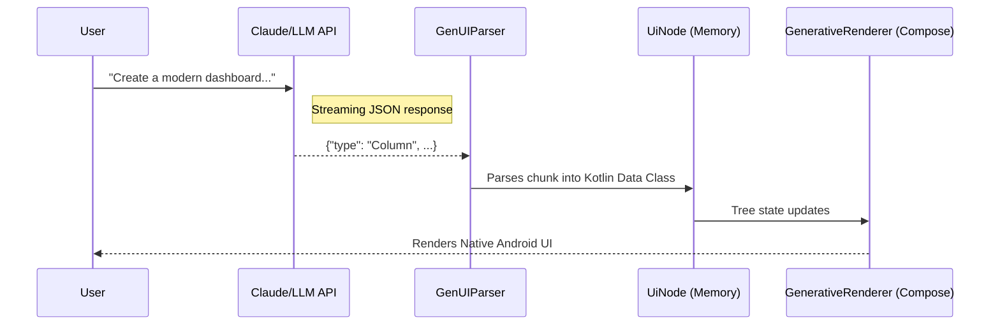

# 🏛️ Compose GenUI Architecture

This document explains how data flows from an AI prompt to a native Jetpack Compose UI.

## The Flowchart

## The Three Pillars

1. **The Schema (`UiNode.kt`)**: The strict contract between the AI and the App.
2. **The Parser (`GenUIParser.kt`)**: The engine that safely converts streaming JSON into Kotlin objects.
3. **The Renderer (`GenerativeRenderer.kt`)**: The recursive Jetpack Compose function that draws the nodes on the screen.
