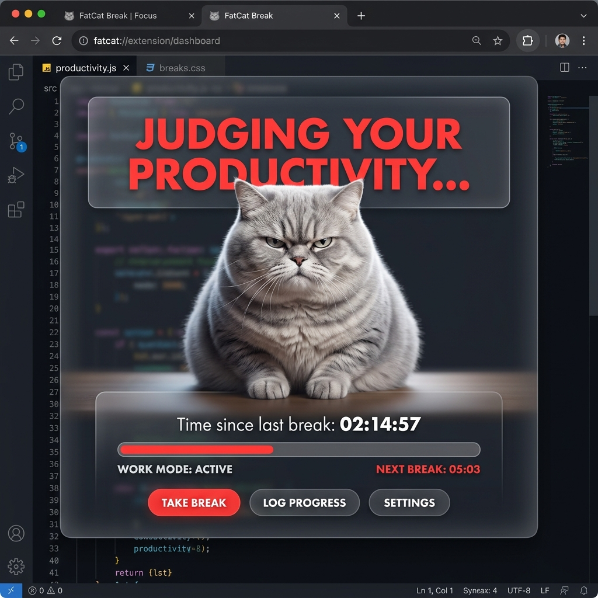

# 🐱 FatCat Break



> The most judgmental productivity tool ever built.

FatCat Break is an open-source Chrome extension that uses the power of "Chonky Judgment" to force you to take breaks. Every 25 minutes (or your custom interval), a giant, breathing, judgmental CSS cat will take over your entire screen. You can't scroll. You can't click. You can only contemplate your life choices for 5 minutes.


## 🚀 Features

- 🎯 **Site-Specific Hijacking:** Only blocks you on distracting sites (YouTube, Reddit, Instagram, etc.).
- 🧠 **Intelligent Tab Tracking:** Timer only counts when a distraction tab is active and visible.
- 🐈 **The "Forced Break":** A giant, breathing, judgmental CSS cat takes over your screen once the limit is hit.
- ⏳ **Countdown Enforcement:** You must rest until the cat's countdown finishes. No skipping.

## 📦 How to Install (Developer Mode)

1. Clone this repository:
   ```bash
   git clone https://github.com/techcompare/FatCat-Break.git
   ```
2. Open Chrome and navigate to `chrome://extensions/`.
3. Enable **"Developer mode"** in the top right.
4. Click **"Load unpacked"** and select the folder `FatCat-Break`.
5. Prepare to be judged.

## 🛠️ Tech Stack

- **Chrome Extension API (V3)**: Background service workers and alarms.
- **Vanilla JavaScript**: Content injection and state management.
- **CSS Animations**: For the cat's breathing, tail-wagging, and judgmental squinting.

## 📜 Why?

Because we're all addicted to our screens and sometimes a simple notification isn't enough. You need a fat cat to tell you to go touch some grass.

## 🤝 Contributing

This is an open-source project. Feel free to contribute more judgmental animals, better animations, or more aggressive break-forcing features!

## 🤝 Support & Contact

If you have questions, feedback, or want to collaborate on making the cat even more judgmental, reach out at:

📧 **[workwithme785@gmail.com](mailto:workwithme785@gmail.com)**

---

*Built with ❤️ and a lot of judgmental stares.*
